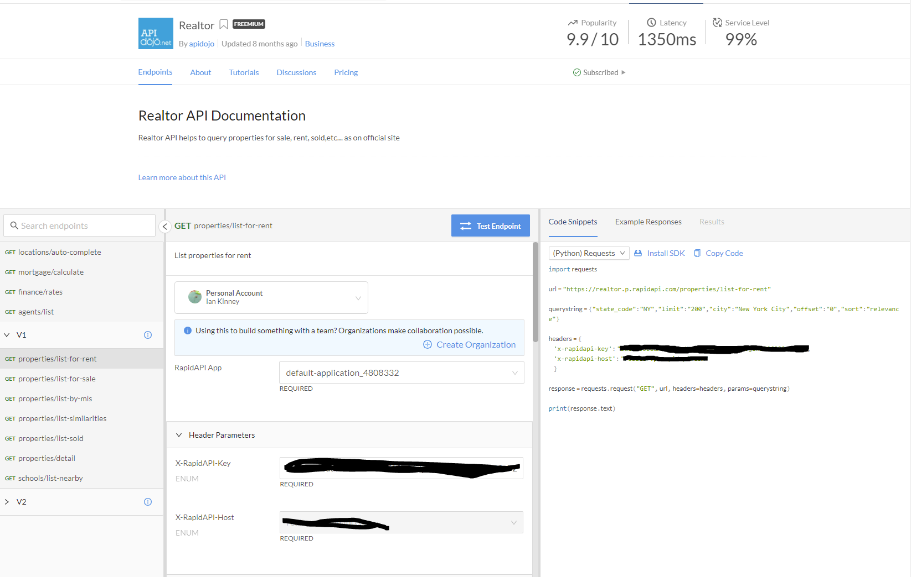
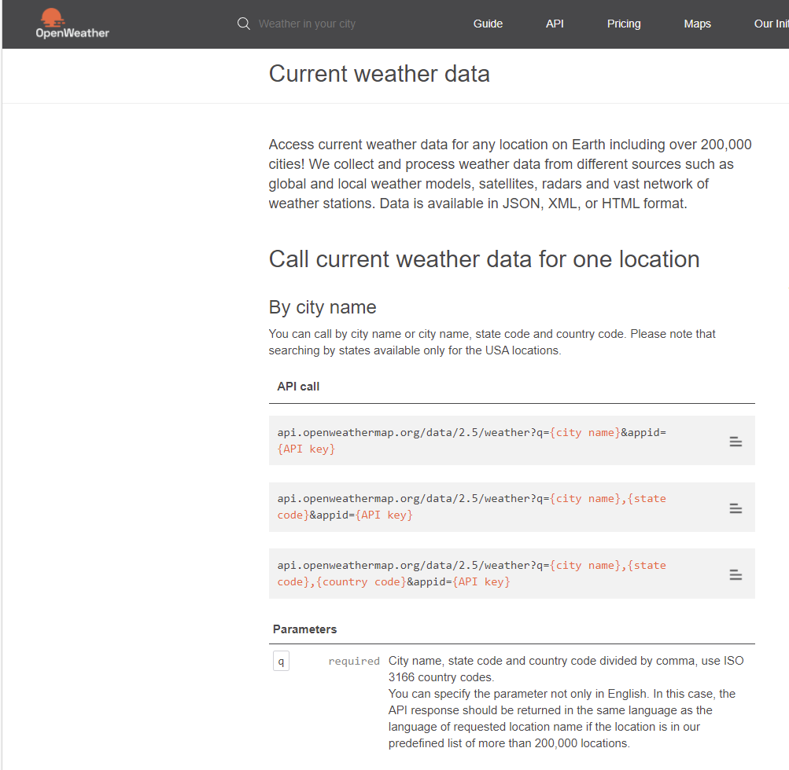

# ETL-Project

## Project Proposal

### Extract

For this project, we extracted data from Realtor API and OpenWeatherMap API. This data is intended to analyze the correlation between weather and property value. We used the Hottest Zip Codes list from Realtor.com to select the top ten hottest zip codes for our project. For both sources, we took our zip code list and used Jupyter Notebook and Pandas to query the API and saved the responses into a DataFrame for the transform process. 

#### Rapid API  - Realtor API

    https://rapidapi.com/apidojo/api/realtor

    Rapid API was used to provide pre-written access code snippets to make it easier to get started!

#### Weather API - Open Weather Map

    https://openweathermap.org/current

    For the weather data, we used Open Weather Map API. 

### Transform

Once we returned query data from both API’s, we used Pandas to build a dataframe. The transform process was not too complicated here. For the realtor data, we cleaned out most of the fields because we were not interested in those data points. We were only concerned with the data that would help us find the best deal in the our inputed zip codes with the best weather. 

### Load

For this process, we loaded the data into a final SQL database that can be used for future analysis by importing the csv files. Using SQLite, we created two separate tables for Weather and Realtor and established the ZipCode as the primary key linking the relationship between the two tables. 

